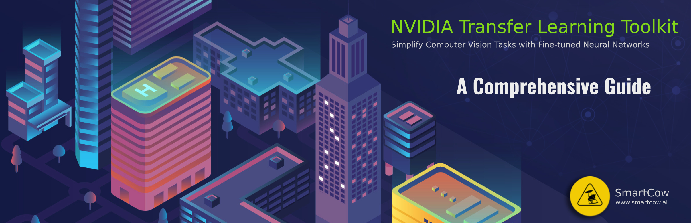
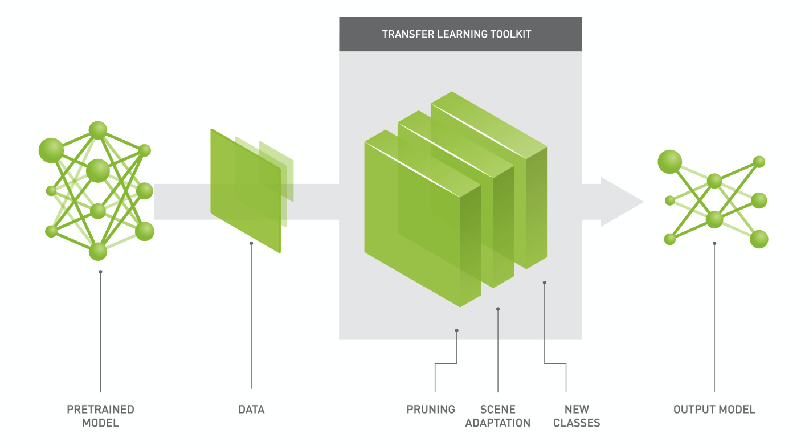

# Nvidia Transfer Learning Toolkit — A Comprehensive Guide

In today’s world, most of the highly optimised Deep Neural Networks architecture is already available to use and what makes it more impressive is the ability to train only the last few layers of a pre-trained model to achieve superhuman accuracy in very less time.

In this article, we are going to train a model on publically available KITTI Dataset, using NVIDIA Transfer Learning Toolkit (TLT) and deploy it to Jetson Nano.

The full article is posted on Medium blog [Read more...](https://medium.com/@Smartcow_ai/nvidia-transfer-learning-toolkit-a-comprehensive-guide-75148d1ac1b)

